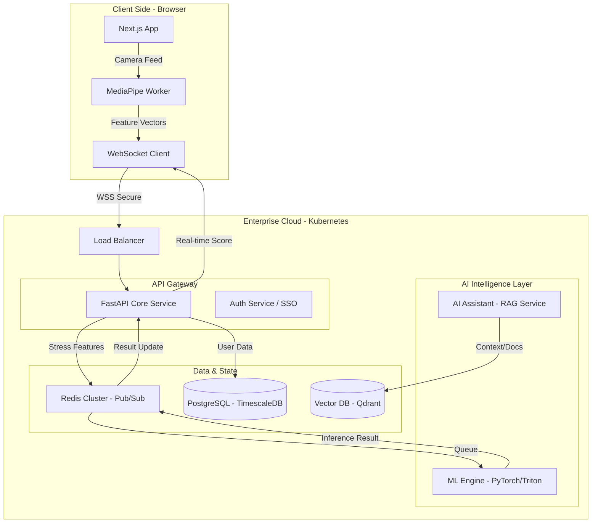
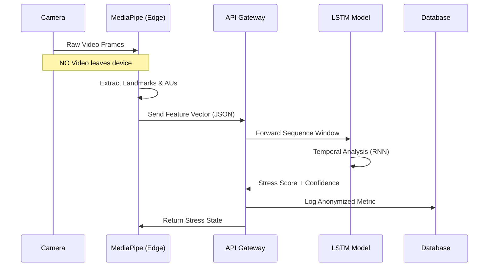
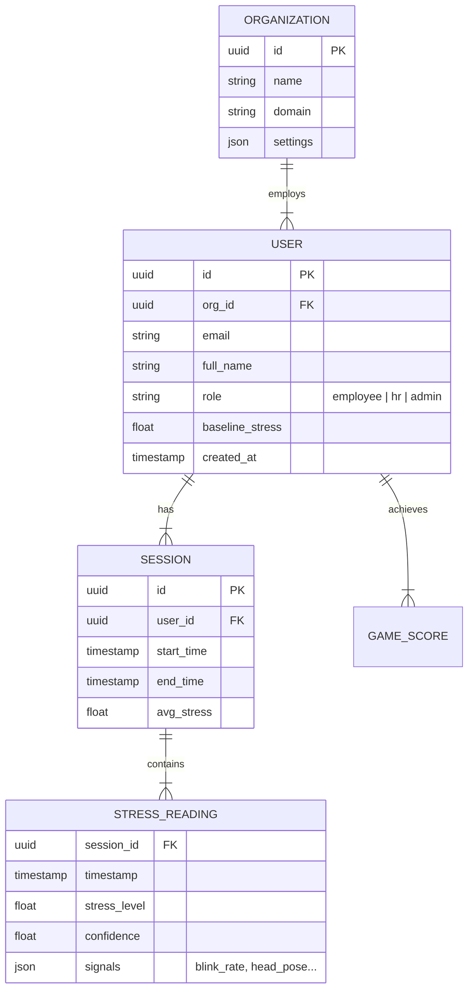

# ZenithAI: Enterprise Stress Detection Platform - Design Document

## 1. System Architecture

ZenithAI follows a **Microservices-based, Event-Driven Architecture** designed for high scalability (10k+ users), privacy, and real-time inference.

### High-Level Architecture (Mermaid)

---

## 2. AI/ML Pipeline

The core of ZenithAI is a hybrid edge-cloud pipeline. Sensitive video data is processed **locally** to preserve privacy. Only numerical feature vectors are transmitted.

### Pipeline Flow

1.  **Input**: Webcam Video Stream.
2.  **Edge Processing (Client-Side)**:
    *   **Face Mesh**: 468 landmarks (MediaPipe).
    *   **Feature Extraction**: Eye Aspect Ratio (EAR), Head Pose (Yaw/Pitch/Roll), Blink Rate.
3.  **Transmission**: JSON payload of features sent via WebSocket (5Hz - 10Hz).
4.  **Cloud Preprocessing**:
    *   Normalization (Z-score based on user baseline).
    *   Windowing (Sliding window of 30-60 frames).
5.  **Inference (Server-Side)**:
    *   **Model**: LSTM + Attention Mechanism.
    *   **Input**: `(Batch, Time_Steps, Features)`.
    *   **Output**: Stress Level (0.0 - 1.0), Class (Low, Medium, High).
6.  **Post-Processing**:
    *   Smoothing (Exponential Moving Average).
    *   Contextual Analysis (Feedback loop to AI Assistant).

### ML Diagram

---

## 3. Database Schema

We use **PostgreSQL** with a Time-Series focus (conceptually compatible with TimescaleDB) for storing stress trends, and a relational structure for users and organizations.

### Entity Relationship Diagram

---

## 4. Tech Stack Justification

| Layer | Technology | Justification |
| :--- | :--- | :--- |
| **Frontend** | **Next.js 14 + React** | SSR for performance, huge ecosystem, enterprise standard. |
| **UI** | **Tailwind + Framer Motion** | "Google-level" polish requires rapid styling and fluid animations. |
| **Backend** | **FastAPI (Python)** | High-performance async support (Starlette), native integration with PyTorch/ML libraries. |
| **ML Inference** | **PyTorch + MediaPipe** | MediaPipe is SOTA for lightweight vision. PyTorch is best for dynamic LSTM/RNN models. |
| **Database** | **PostgreSQL** | Rock-solid reliability, JSON support, time-series capable. |
| **Real-time** | **WebSockets** | Mandatory for streaming stress data with low latency (<200ms). |
| **Infrastructure** | **Docker + Kubernetes** | Scalability for 10k+ concurrent users. Autoscaling ML pods. |

---

## 5. Security & Ethics Framework

### Privacy-First Architecture ("Zero Video Storage")
*   **Principle**: Raw video data **never** touches our servers.
*   **Implementation**: MediaPipe runs in the browser via WebAssembly (WASM).
*   **Data Minimization**: Only numerical coordinates and calculated metrics (e.g., "blink rate") are transmitted.

### Enterprise Security
*   **Encryption**: TLS 1.3 for all data in transit (WebSockets/HTTPS). AES-256 for data at rest.
*   **Authentication**: OAuth2 / OIDC compliant (Google/Microsoft SSO integration ready).
*   **Role-Based Access Control (RBAC)**:
    *   `Employee`: See own data only.
    *   `HR_Admin`: See aggregated, anonymized trends (no individual data).
    *   `Sys_Admin`: Infrastructure management.

### AI Ethics
*   **Bias Mitigation**: Model trained on diverse datasets (WESAD, FER2013) to ensure fairness across ethnicities/genders.
*   **Explainability**: SHAP values provided for high-stress alerts (e.g., "Alert triggered by sustained brow furrowing + low blink rate").
*   **No Diagnosis**: The AI Assistant explicitly states it provides "wellness guidance" and is not a medical device.

---

## 6. Scalable SaaS Deployment Strategy

1.  **Containerization**: All services (API, Worker, Frontend) are Dockerized.
2.  **Orchestration**: Kubernetes (EKS/GKE).
3.  **Horizontal Pod Autoscaling (HPA)**:
    *   frontend: CPU-based scaling.
    *   ml-worker: GPU/Queue-depth based scaling.
4.  **CDN**: Cloudflare/AWS CloudFront for static assets (Next.js build).
5.  **Multi-Tenancy**: Row-level security in Postgres where `org_id` isolates data.

## 7. Future Roadmap

*   **Q1**: MVP Launch (Webcam Stress Detection + Dashboard).
*   **Q2**: Games Module + Advanced RAG Assistant.
*   **Q3**: Enterprise Integrations (Slack/Teams Bots, HRMS).
*   **Q4**: Wearable Integration (Apple Watch/Fitbit Heart Rate fusion).
*   **Future**: Brain-Computer Interface (BCI) readiness (EEG data ingestion).
