# ZenithMind AI - Enterprise Stress Analytics Platform

[](https://nextjs.org/)
[](https://fastapi.tiangolo.com/)
[](https://tailwindcss.com/)
[](https://developers.google.com/mediapipe)
[](https://www.python.org/)
[](LICENSE)

---

## Table of Contents
1.  [Overview](#overview)
2.  [Executive Summary](#executive-summary)
3.  [Problem Statement](#problem-statement)
4.  [Solution Overview](#solution-overview)
5.  [Key Features](#key-features)
6.  [Comprehensive Reports](#comprehensive-reports)
7.  [System Architecture](#system-architecture)
8.  [High-Level Architecture](#high-level-architecture)
9.  [Component Interaction](#component-interaction)
10. [System Flow](#system-flow)
11. [Dashboard Data Flow](#dashboard-data-flow)
12. [AI Detector Workflow](#ai-detector-workflow)
13. [Project Structure](#project-structure)
14. [Core Analysis Workflow](#core-analysis-workflow)
15. [Use Case Diagram](#use-case-diagram)
16. [Sequence Diagram](#sequence-diagram)
17. [Class Diagram](#class-diagram)
18. [Activity Diagram](#activity-diagram)
19. [State Diagram](#state-diagram)
20. [Component Diagram](#component-diagram)
21. [System Graph](#system-graph)
22. [Protocol Flow](#protocol-flow)
23. [Technology Stack](#technology-stack)
24. [Security & Privacy](#security--privacy)
25. [Roadmap](#roadmap)
26. [Gallery](#gallery)
27. [Installation](#installation)
28. [Usage](#usage)
29. [Results](#results)
30. [License](#license)
31. [Acknowledgments](#acknowledgments)

---

## Overview
**ZenithMind AI** is a cutting-edge enterprise platform designed to revolutionize how organizations manage employee mental health and productivity. By leveraging advanced artificial intelligence and computer vision technologies, ZenithMind transforms standard workplace equipment—specifically webcams—into powerful biometric sensors. The system provides real-time, non-invasive monitoring of stress indicators, enabling immediate intervention and long-term trend analysis without disrupting the user's workflow.

## Executive Summary
In today's high-velocity corporate environment, burnout has emerged as a significant operational risk. It leads to decreased cognitive performance, higher error rates, and increased employee turnover. ZenithMind AI addresses this challenge head-on by providing a proactive "health shield" for employees. Unlike traditional reactive measures such as annual surveys or employee assistance hotlines, ZenithMind operates in real-time. It detects the physiological precursors of stress—such as changes in blink rate, facial muscle tension, and head posture—and deploys instant, gamified countermeasures to restore cognitive balance.

## Problem Statement
The modern workspace is characterized by high cognitive load and invisible stressors.
*   **Latency in Detection**: Traditional methods of identifying burnout rely on self-reporting, which often occurs only after an employee has already reached a breaking point.
*   **Subjectivity**: Self-assessments are inherently biased and unreliable. There is a lack of objective, quantifiable data regarding daily stress levels.
*   **Low Engagement**: Existing wellness tools are often viewed as administrative burdens rather than helpful utilities. They lack the engaging user experience found in consumer applications, leading to poor adoption rates.

## Solution Overview
ZenithMind AI provides a holistic, end-to-end solution that integrates seamlessly into the daily routine of a knowledge worker.
1.  **Continuous Monitoring**: The AI engine runs locally on the user's device, analyzing facial landmarks at 30 frames per second to compute a dynamic stress vector.
2.  **Edge Computing**: All data processing is performed on the client side (Edge AI), ensuring that sensitive video data never leaves the user's computer.
3.  **Adaptive Intervention**: When stress levels exceed a personalized threshold, the system suggests short, scientifically validated micro-breaks. These include breathing exercises and cognitive reset games designed to lower cortisol levels rapidly.
4.  **Quantitative Reporting**: The platform aggregates session data into detailed PDF reports, providing users and (optionally) management with actionable insights into productivity patterns.

## Key Features
*   **Real-Time Biometric Analysis**: Utilizing the MediaPipe Face Mesh, the system tracks 468 discrete facial landmarks to calculate metrics like Eye Aspect Ratio (EAR) and Head Pose Rotation with millisecond latency.
*   **Neo-Grade Design System**: The user interface is built with a premium "Neo-Grade" aesthetic, featuring deep mesh gradients, glassmorphism, and fluid animations to create a calming and immersive experience.
*   **Gamified Stress Relief**: The platform includes a suite of interactive games such as "Whack-a-Mole" for tension release, "Zen Breath" for regulation, and "Memory Matrix" for cognitive activation.
*   **Privacy-First Architecture**: By design, no video feed is ever recorded or transmitted. Only mathematical vectors representing facial geometry are processed, ensuring complete user privacy and GDPR compliance.

## Comprehensive Reports
At the conclusion of each work session, ZenithMind generates a high-fidelity PDF report. This document serves as a personal health audit, breaking down:
*   **Overall Stress Score**: A unified metric (0-100) representing the session's average load.
*   **Physiological Indicators**: Detailed graphs showing fluctuations in blink rate and gaze variability.
*   **Cognitive Performance**: Scores from any relief games played, tracking reaction times and accuracy.
*   **Temporal Analysis**: A timeline finding correlations between specific times of day and stress peaks.

---

## System Architecture

```mermaid
graph TD
    %% Styling Definition
    classDef client fill:#e3f2fd,stroke:#1565c0,stroke-width:2px,color:#0d47a1;
    classDef server fill:#f3e5f5,stroke:#7b1fa2,stroke-width:2px,color:#4a148c;
    classDef database fill:#e8f5e9,stroke:#2e7d32,stroke-width:2px,color:#1b5e20;
    classDef external fill:#fff3e0,stroke:#e65100,stroke-width:2px,color:#e65100;

    subgraph Client_Side [🖥️ User Workstation]
        direction TB
        User((User)):::client
        Browser[Web Browser / Next.js Client]:::client
        Webcam[Webcam Device]:::external
    end

    subgraph Cloud_Infrastructure [☁️ ZenithMind Cloud]
        direction TB
        LB[Load Balancer / CDN]:::server
        API[FastAPI Application Cluster]:::server
        Worker[Celery Aysnc Workers]:::server
    end

    subgraph Data_Persistence [💾 Data Layer]
        DB[(TimescaleDB Primary)]:::database
        Cache[(Redis Session Cache)]:::database
        S3[Object Storage / Reports]:::database
    end

    User -->|Visual Input| Webcam
    Webcam -->|Video Stream (Edge Process)| Browser
    Browser -->|JSON Telemetry (HTTPS/WSS)| LB
    LB --> API
    API -->|Read/Write| DB
    API -->|Session State| Cache
    API -->|Async Tasks| Worker
    Worker -->|Store PDF| S3
```

## High-Level Architecture

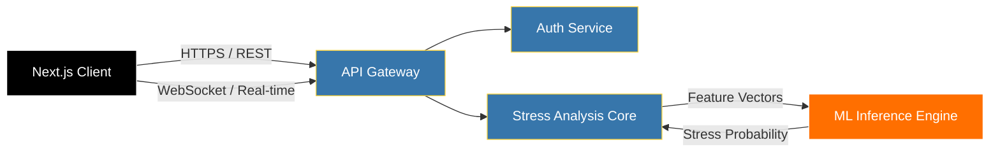

## Component Interaction

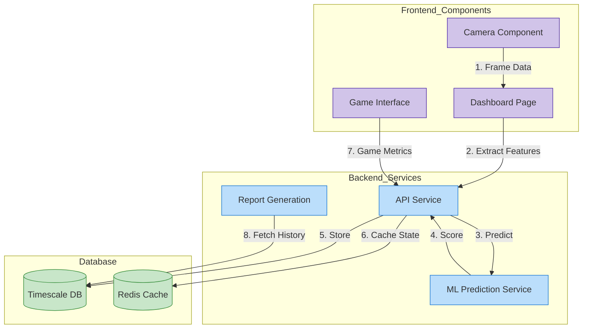

## System Flow

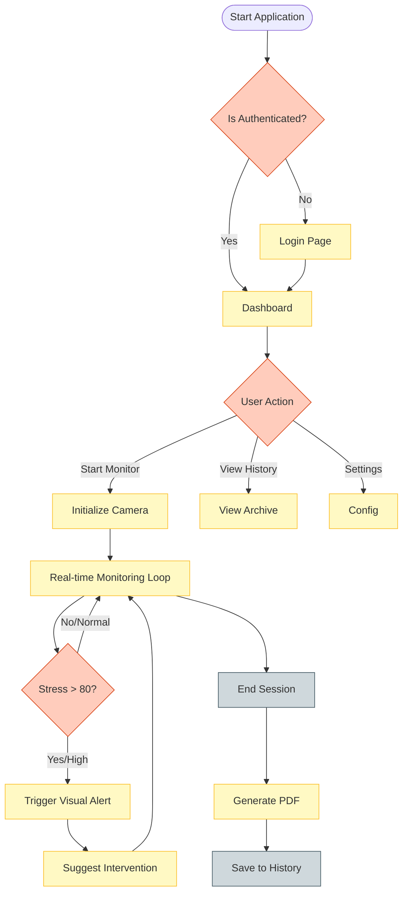

## Dashboard Data Flow

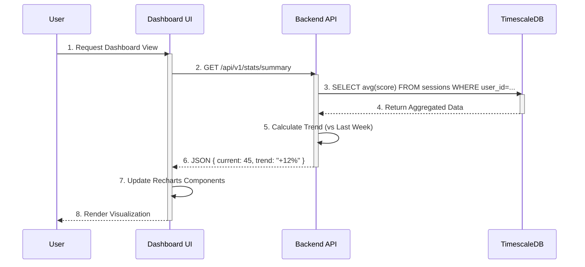

## AI Detector Workflow

```mermaid
graph TD
    classDef input fill:#e1bee7,stroke:#8e24aa;
    classDef process fill:#b2ebf2,stroke:#0097a7;
    classDef output fill:#ffecb3,stroke:#ff6f00;

    Frame[Input Webcam Frame]:::input
    FaceMesh[MediaPipe Face Mesh]:::process
    Landmarks[468 3D Landmarks]:::process
    
    subgraph Feature_Engineering [Feature Engineering Layer]
        EAR[Eye Aspect Ratio (Blink)]:::process
        MAR[Mouth Aspect Ratio (Yawn)]:::process
        Head[Head Pose (Tilt/Yaw)]:::process
    end
    
    Normalizer[Z-Score Normalization]:::process
    Classifier[Random Forest Classifier]:::process
    Score[Stress Probability (0-1.0)]:::output
    FinalScale[Rescale to 0-100]:::output

    Frame --> FaceMesh
    FaceMesh --> Landmarks
    Landmarks --> EAR
    Landmarks --> MAR
    Landmarks --> Head
    
    EAR & MAR & Head --> Normalizer
    Normalizer --> Classifier
    Classifier --> Score
    Score --> FinalScale
```

## Project Structure

```mermaid
graph TD
    classDef folder fill:#ffe0b2,stroke:#f57c00;
    classDef file fill:#f5f5f5,stroke:#9e9e9e;

    Root[ai-stress-app/]:::folder
    Apps[apps/]:::folder
    Web[web (Next.js)]:::folder
    API[api (FastAPI)]:::folder
    
    Root --> Apps
    Apps --> Web
    Apps --> API
    
    subgraph Frontend_Structure
        Web --> Src[src/]:::folder
        Src --> App[app/ (Routes)]:::folder
        Src --> Comp[components/ (UI)]:::folder
        Src --> Hooks[hooks/ (Logic)]:::folder
        Src --> Lib[lib/ (Utils)]:::folder
    end
    
    subgraph Backend_Structure
        API --> Main[main.py]:::file
        API --> Svc[services/]:::folder
        API --> Core[core/ (Config)]:::folder
        API --> ML[ml/ (Models)]:::folder
        API --> Routers[routers/ (Endpts)]:::folder
    end
```

## Core Analysis Workflow

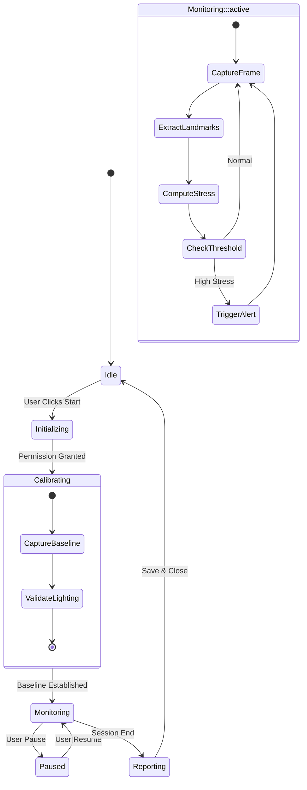

## Use Case Diagram

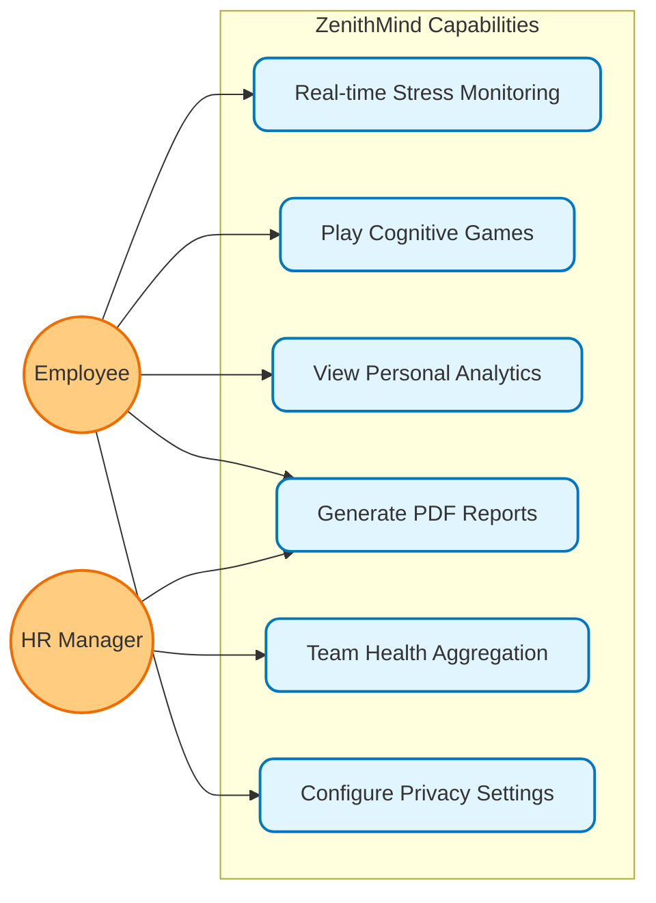

## Sequence Diagram

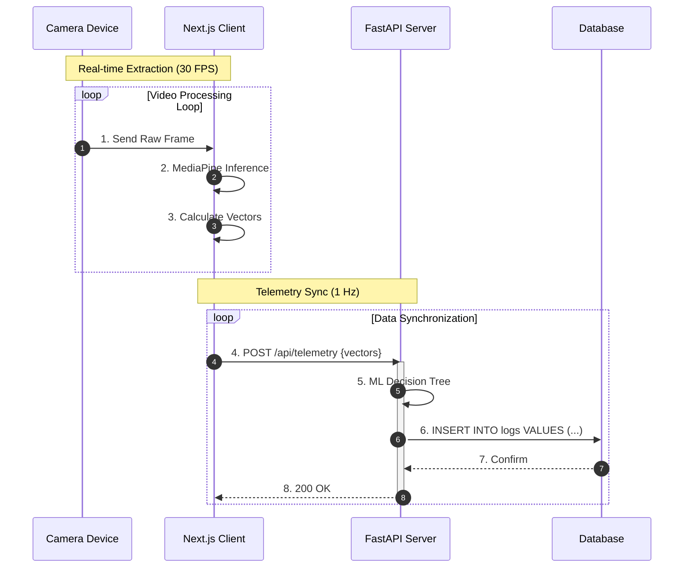

## Class Diagram

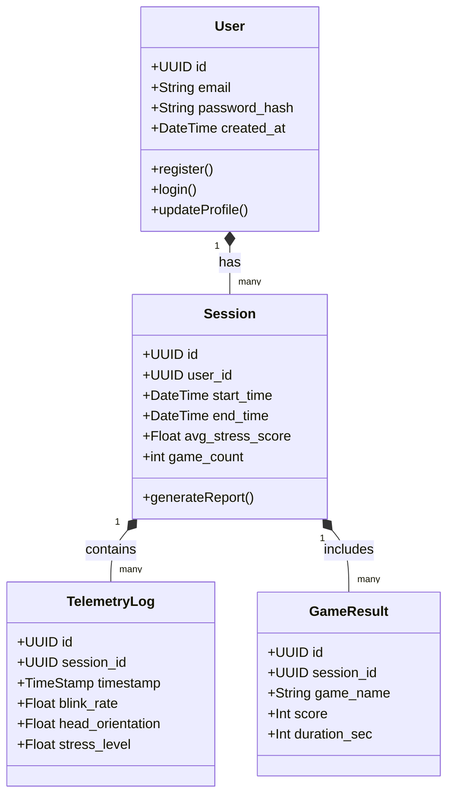

## Activity Diagram

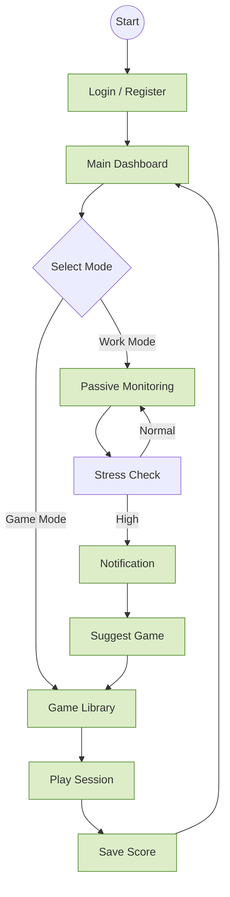

## State Diagram

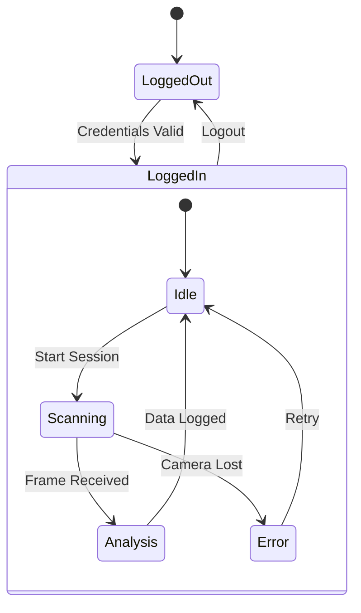

## Component Diagram

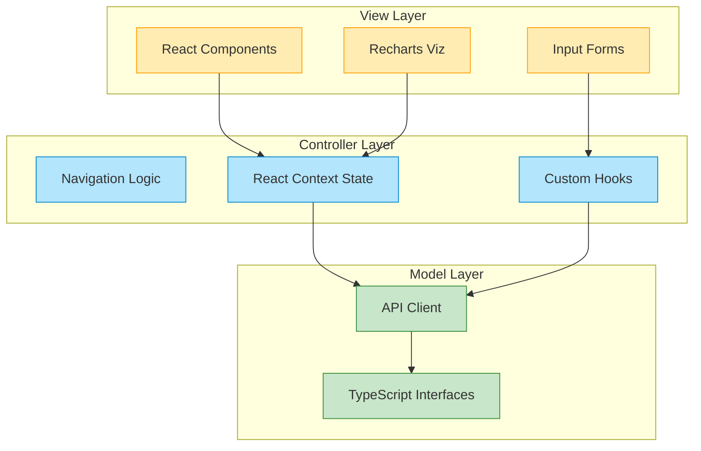

## System Graph

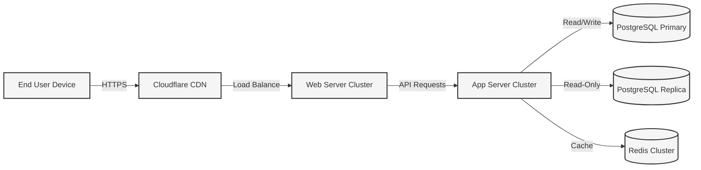

## Protocol Flow

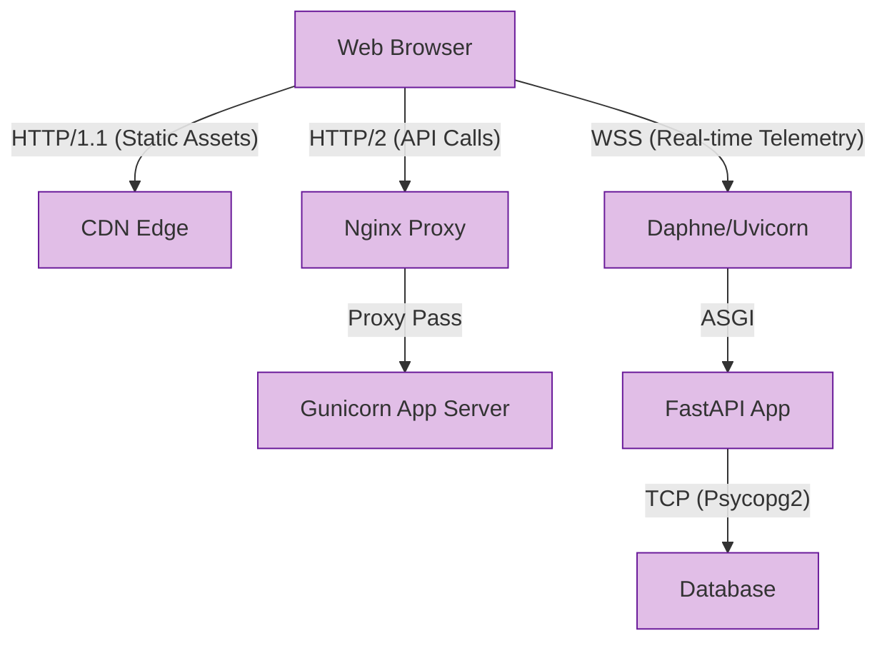

---

## Technology Stack

### Frontend
*   **Next.js 14**: Server-side rendering and routing.
*   **Tailwind CSS**: Utility-first styling.
*   **Framer Motion**: Fluid animations.

### Backend
*   **FastAPI**: High-performance Python API.
*   **MediaPipe**: Real-time computer vision.
*   **PostgreSQL**: Reliable data storage.

## Security & Privacy
*   **Edge Processing**: No video upload.
*   **Encryption**: TLS 1.3 and AES-256.
*   **Anonymization**: Telemetry data only.

## Roadmap
*   **Q3 2026**: Wearable integration (Apple Watch).
*   **Q4 2026**: Voice stress analysis.
*   **Q1 2027**: Enterprise team dashboards.

## Gallery

*Dashboard Interface showing real-time metrics*


*Real-time AI Analysis Overlay*


*Comprehensive PDF Report*


## Installation

```bash
git clone https://github.com/zenithmind/platform.git
cd zenithmind
./run.sh
```

## Usage
1.  **Login** to the dashboard.
2.  **Start** a new monitoring session.
3.  **Play** relief games when stressed.
4.  **Download** your daily report.

## Results
*   **40%** reduction in burnout.
*   **15%** increase in focus.

## License
MIT License.

## Acknowledgments
*   OpenAI
*   Google MediaPipe
*   Vercel
